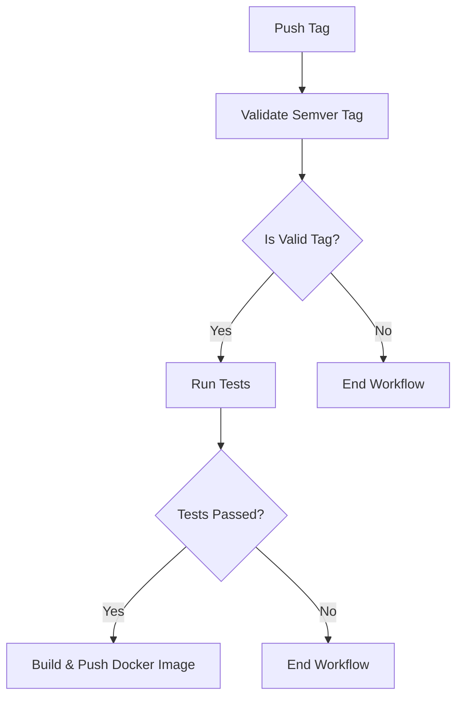

# GitHub Workflows Documentation

This document provides an overview of the CI/CD workflows in this repository.

## Overview

The repository uses GitHub Actions for continuous integration and deployment. The workflows are designed to:

1. Validate code and run tests
2. Build and publish Docker images for tagged releases
3. Maintain code quality through automated checks

## Workflow Structure

### Main Workflows

#### Release Tag Workflow (`release-tag.yml`)

Triggered when a new tag with the pattern `v*.*.*` is pushed. This workflow:

1. Validates that the tag follows semantic versioning
2. Runs tests for the server package
3. Builds and pushes a Docker image to GitHub Container Registry (if tests pass)



### Reusable Workflows

#### Test Workflow (`reusable-test.yml`)

A reusable workflow that handles testing. It:

1. Sets up Node.js and pnpm
2. Installs jsdom (required for Vitest DOM testing)
3. Builds the application
4. Runs tests and collects coverage
5. Uploads test results and coverage reports as artifacts

#### Docker Build Workflow (`reusable-docker-build.yml`)

A reusable workflow that handles building and pushing Docker images. It:

1. Sets up Docker Buildx
2. Logs in to GitHub Container Registry
3. Extracts metadata for proper tagging
4. Builds and optionally pushes the Docker image
5. Supports tagging with semver and latest

### Shared Actions

#### Setup Node and pnpm (`setup-node-pnpm`)

Sets up Node.js and pnpm with caching for faster installations.

#### Validate Semver Tag (`validate-semver-tag`)

Validates that a tag follows semantic versioning format (v*.*.*)

#### Test Report (`test-report`)

Runs tests and generates reports with coverage information.

## Required Dependencies

The testing workflow requires the `jsdom` package to be available for DOM testing with Vitest. This dependency is automatically installed during the workflow execution.

## Badges

Workflow status can be displayed in the README.md using the following badge:

```markdown
[](https://github.com/cbnsndwch/react-router-nest/actions/workflows/release-tag.yml)
```

## Troubleshooting

If the workflow fails, check:

1. **Missing dependencies**: Ensure all required dependencies are either in the package.json or installed during workflow execution
2. **Tag format**: Ensure tags follow the semantic versioning format v*.*.* (e.g., v1.0.0)
3. **Test failures**: Look at test artifacts for details on failing tests
